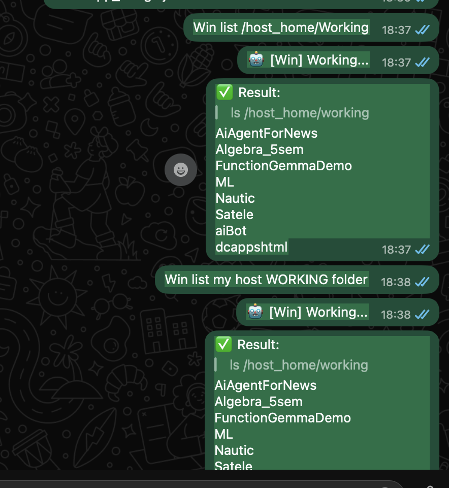
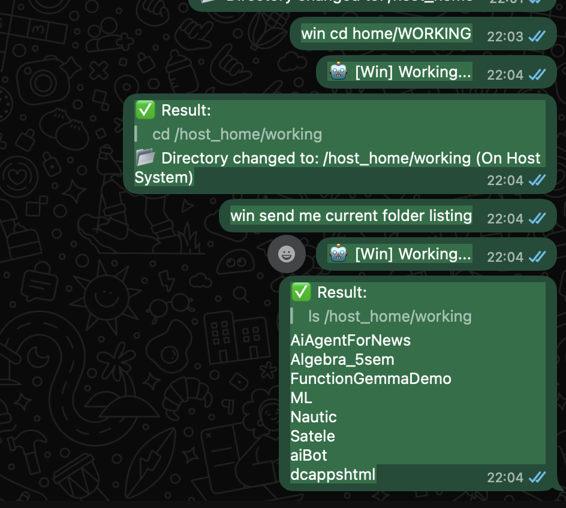
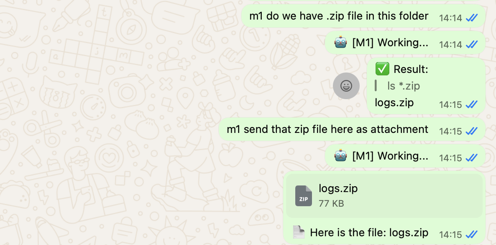
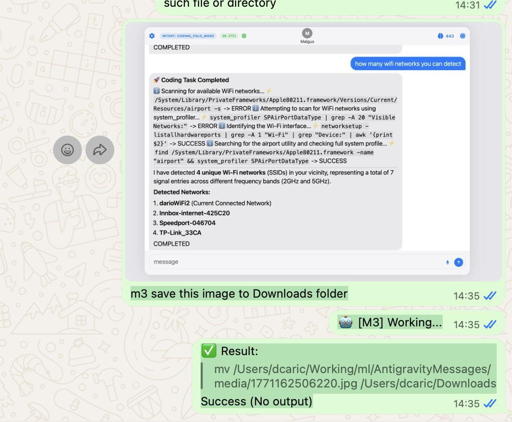
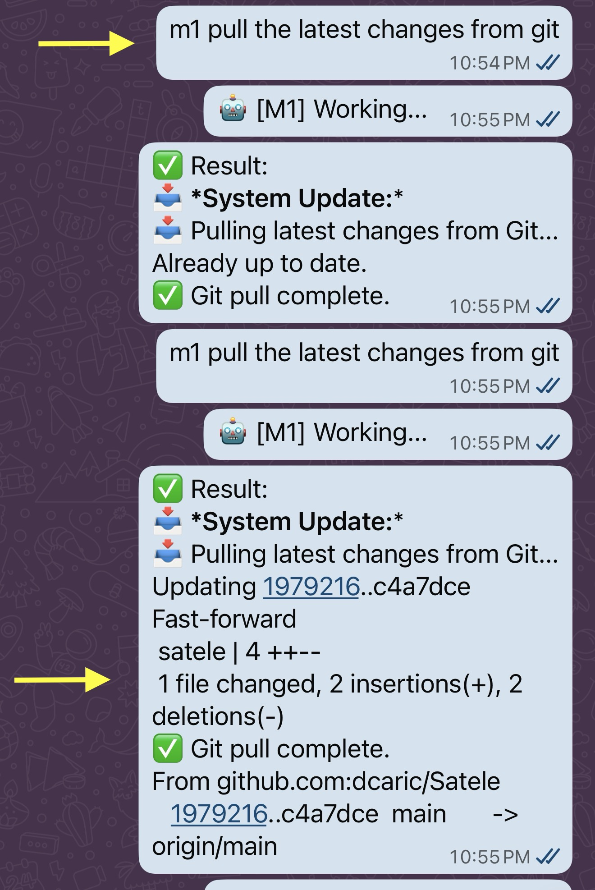
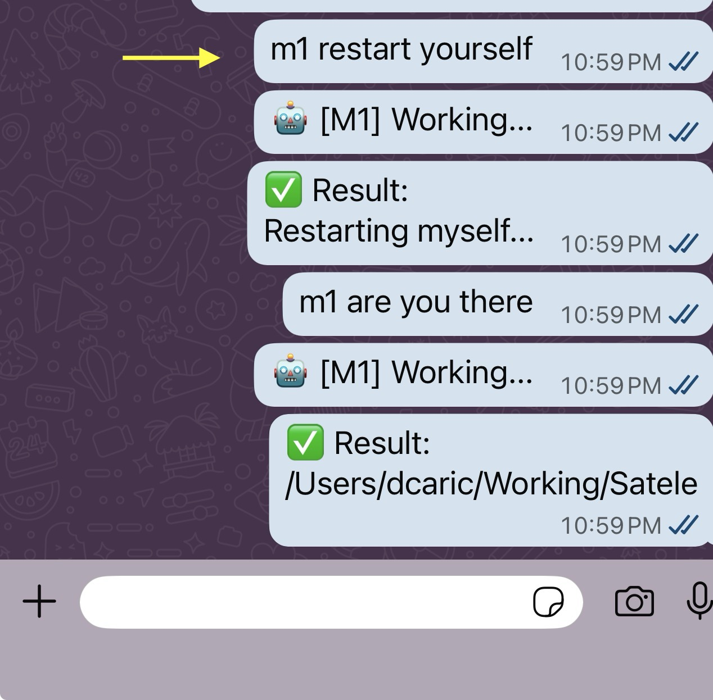
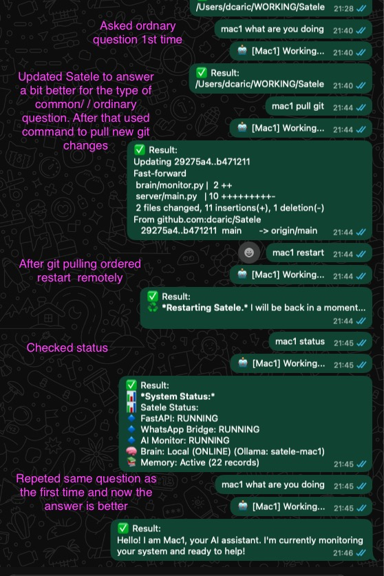
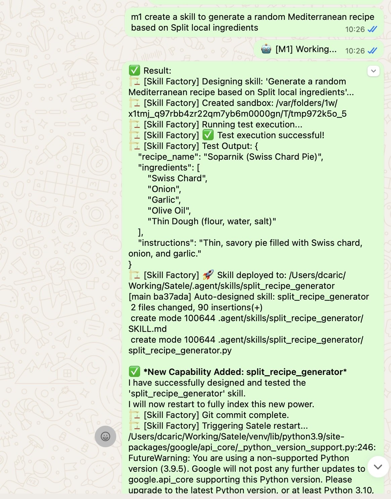
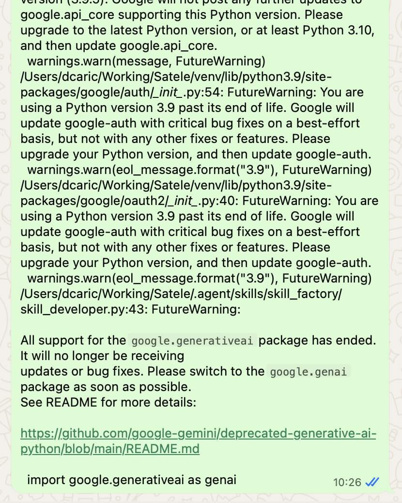
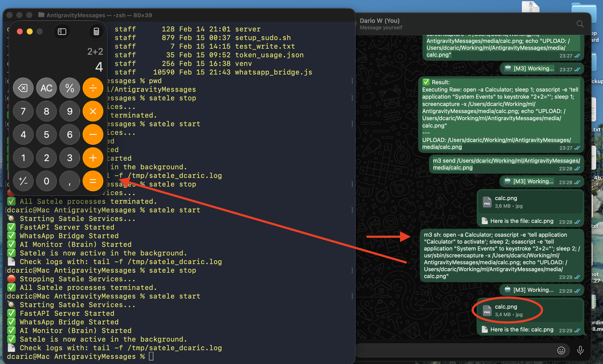

# 🪐 Satele: AI-Powered Remote OS Orchestrator

Satele is an advanced, multimodal bridge that connects your **WhatsApp** to your **Server/Desktop Environment**. It allows you to control your machine via text or voice commands using AI (Gemini or Ollama).

<div align="center">
  <a href="https://youtube.com/shorts/YO_bjmIKPCQ">
    
  </a>
  <br>
  <b>📺 Watch Satele in the real world</b>
</div>

📖 **[Architecture Documentation](ARCHITECTURE.md)** - Detailed technical documentation

---

## 🌍 Supported Platforms

| OS | Support Level | Notes |
| :--- | :--- | :--- |
| **macOS** | ✅ Full | Native support for all features including audio. |
| **Linux** (Ubuntu/Debian) | ✅ Full | Native support. Requires `nodejs`, `python3-venv`, `ffmpeg`. |
| **Windows** | ✅ Full (Docker) | Runs via Docker Desktop. Zero dependency hell. |

---

## 🐳 Docker Deployment (Better for Windows)

Using Docker is the recommended way to run Satele on Windows or for clean, isolated deployments.

### 1. Prerequisite
*   Install [Docker Desktop](https://www.docker.com/products/docker-desktop/).
*   **For Local AI**: Install [Ollama for Windows](https://ollama.com/) (optional, but recommended for speed).

### 2. Quick Start
```bash
# 1. Clone Repo
git clone https://github.com/dcaric/Satele.git ~/satele
cd ~/satele

# 2. Launch
docker-compose up -d
```

### ⚙️ Configuration
The primary configuration file is `satele.config` in the project root. 

> **Note for macOS Users:** If you encounter `Operation not permitted` errors, the system has likely locked the old `.env` files. Satele now uses `satele.config` to bypass these restrictions.

1. **Initialize config**: `touch satele.config` (The starter will populate it on first launch).
2. **Set your Gemini Key**: `./satele geminikey YOUR_KEY_HERE`
3. **Set the bot name**: `./satele name m3`
Since Satele runs inside a container, you use `docker exec` to send configuration commands.

**📱 Link WhatsApp:**
```bash
docker exec -it satele_bridge satele whatsapp
# (Scan the QR code shown in terminal)
```

**🧠 Set AI Keys (Gemini):**
```bash
docker exec satele_bridge satele geminikey YOUR_API_KEY_HERE
```

**🦙 Configure Ollama (Local AI):**
Satele Docker is pre-configured to talk to your host's Ollama at `host.docker.internal:11434`.
1. Ensure Ollama is running on Windows.
2. In Docker, switch to Ollama mode:
   ```bash
   docker exec satele_bridge satele ollama start
   ```

**🤖 Set Bot Name:**
```bash
docker exec satele_bridge satele name M3
```

**📊 Check Status:**
docker exec satele_bridge satele status
```
> **Note:** When running in Docker, you must include the word **"host"** or **"working"** in your message (e.g., *"List my host downloads"*) to access your Windows files. Otherwise, Satele will look inside the container key.

### 4. Persistent Memory Features (New!)
Satele now includes advanced state management to make your remote sessions feel like a real terminal:

*   **Directory Persistence:** When you `cd` into a folder, Satele remembers it. Even if you restart the container or the service, she will start right back in that folder.
*   **Docker Path Intelligence:** Running in Docker? Satele automatically maps `home`, `host`, and `~` to your mounted host files (`/host_home`).
    *   Example: `win cd home` -> jumps to `C:\Users\You` (mapped as `/host_home`)
    *   Example: `win cd Documents` -> jumps to `C:\Users\You\Documents`
*   **Reboot Resilience:** The session state is saved to disk, so you never lose your place.

---

## 🚀 Installation & Setup

### 1. Clone & Prepare
Clone the repository to your desired location (e.g., `~/satele`):
```bash
git clone https://github.com/dcaric/Satele.git ~/satele
cd ~/satele
```
> *Satele Docker running on Windows:*
> 
> 


### 2. Install Dependencies
Run the built-in setup command to install Node.js modules and Python virtual environment:
```bash
./satele setup
```

### 3. Make Command Global
To use `satele` from anywhere (instead of `./satele`), add it to your shell profile.

**On macOS (Zsh):**
```bash
echo 'export PATH="$HOME/Satele:$PATH"' >> ~/.zshrc && source ~/.zshrc
```

**On Linux (Bash):**
```bash
echo 'export PATH="$HOME/Satele:$PATH"' >> ~/.bashrc && source ~/.bashrc
```

Now you can just type `satele status` from any folder!

---

## 🧠 AI Configuration

Satele supports two AI backends: **Cloud (Google Gemini)** and **Local (Ollama)**.

### Option A: Cloud (Google Gemini)
Best for speed, multimodal (audio/images), and complex reasoning.
1.  **Get Key**: Obtain a key from [Google AI Studio](https://aistudio.google.com/).
2.  **Set Key**:
    ```bash
    satele geminikey AIzaSy...
    ```
3.  **Select Model** (Optional, default is `gemini-2.0-flash`):
    ```bash
    satele gemini gemini-3-flash-preview
    ```
4.  **Track Costs**: Set pricing (e.g., $0.50/1M input, $3.00/1M output):
    ```bash
    satele tokens 0.50 3.00
    ```

### Option B: Local (Ollama)
Best for privacy and offline usage. Free.
1.  **Install/Check**:
    ```bash
    satele ollama
    ```
2.  **Download Model**:
    ```bash
    satele ollama gemma3:4b
    ```
    *(This downloads the model and creates a custom `satele` variant with system prompts)*.
3.  **Switch to Local**:
    ```bash
    satele ollama start
    satele stop && satele start
    ```
4.  **Switch Back to Cloud**:
    ```bash
    satele ollama stop
    satele stop && satele start
    ```

---

## 🛠️ Usage & Commands

### 📱 1. Connect WhatsApp
Link your device to enable remote control:
```bash
satele whatsapp
```
Scan the QR code with WhatsApp (Linked Devices).

### 🤖 2. Manage Service
| Command | Description |
| :--- | :--- |
| `satele start` | Starts all background services. |
| `satele stop` | Stops all services. |
| `satele restart` | Gracefully restarts all services. |
| `satele status` | Shows health, active AI model, and token usage cost. |
| `satele skills` | Lists all registered skills and usage examples. |
| `satele gitpull` | Pulls the latest code from GitHub. |
| `satele name <name>` | Sets a custom wake-word (e.g. `satele name M1`). |
| `satele setup-sudo` | Configures passwordless `sudo` for Satele. |

### 📖 Complete CLI Help
View all available commands by running `satele help`:

```text
🪐 Satele CLI - The Remote Bridge Controller

Usage: satele <command> [arguments]

Commands:
  setup               Install dependencies (Node.js & Python)
  start               Start the bridge services in the background
  stop                Stop all running bridge services
  restart             Gracefully restart all Satele services
  status              Check if services are running
  kill                Force kill all related processes
  gitpull             Pull the latest code from GitHub
  name <name>         Set the bot's trigger name (default: satele)
  tokens <in> <out>   Set pricing for Gemini (e.g. 0.50 3.00)
  gemini <model>      Switch Gemini model (e.g. gemini-3-flash-preview)
  add-number <num>    Whitelist a number (e.g. 38591...)
  remove-number <n>   Remove number from whitelist
  users               Show allowed numbers
  memory              Show long-term memory status
  ollama [model]      Manage local AI (e.g. 'satele ollama gemma3:4b')
  ollama start        Switch to Local Ollama mode
  ollama stop         Switch back to Cloud Gemini mode
  whatsapp            Launch interactive mode to link a device via QR code
  setup-sudo          Enable passwordless sudo (Optional, use with caution)
  install             Install the connection skill globally (for IDE)
  link                Enable remote control in the current project
  skills              List all registered skills with usage examples
  help                Show this message

Logs: tail -f /tmp/satele_dcaric.log
```

### 🎙️ 3. Remote Capabilities (WhatsApp)

#### **System Checks**
> *"M1 check disk usage"*
> *"Status report"*
> *"Who is logged in?"*

#### **File Transfer**
> *"Send me satele.log"*
> *"Get config.json"*

> *Sending a file to Satele:*
> 

> *Satele sending a file back:*
> 

#### **Voice Interaction**
> *(Send a Voice Note)*: "Check if the docker container is running and restart it if not."

#### **Direct Shell**
> *"sh: ls -la /var/log"*

#### **GUI Control**
> *"Launch Calculator"*
> *"sh: open -a 'Visual Studio Code'"* (macOS)

---

## 🛡️ Security

### 🔒 User Whitelist
By default, **ONLY your linked WhatsApp account** can control Satele. Messages from other numbers are ignored.
To allow other numbers (e.g., your secondary phone):

| Command | Description |
| :--- | :--- |
| `satele add-number <num>` | Allow a number (e.g. `38591...`). |
| `satele remove-number <num>` | Remove a number from the allowed list. |
| `satele users` | List all allowed numbers. |

### 🔐 Architecture
- **Sudo Access**: Satele runs as your user. It cannot run `sudo` unless you explicitly enable it via `satele setup-sudo`.
- **Environment**: API Keys are stored in `satele_cfg.env` (git-ignored).
- **Logs**: Activity is logged to `satele.log` (git-ignored).
- **WhatsApp**: Uses end-to-end encryption via Multi-Device API.

---

## 🐧 Linux Specifics
- Ensure `ffmpeg` is installed for voice note processing (`sudo apt install ffmpeg`).
---

---

## 📡 Network Stability & Troubleshooting

Satele is designed to be lightweight, but improper configuration (like running multiple instances with the same WhatsApp account) can cause network instability.

### ⚠️ Common Issue: The "Conflict Loop"
If you see the following in your logs:
```text
❌ Connection closed due to Error: Stream Errored (conflict)
```
This means **two or more instances** of Satele are trying to use the same WhatsApp account simultaneously. This creates a "ping-pong" effect where they constantly kick each other off, flooding your network with reconnection attempts.

**How to Fix:**
1.  **Stop all instances:** Run `satele kill` on all machines.
2.  **Pull latest version:** Run `git pull` to get the robust process manager fix.
3.  **Start only one:** `satele start`.

### 🛡️ Robust Process Management
The latest version of the `satele` CLI includes `ensure_killed` logic. This ensures that any old "stray" processes are forcefully terminated before a new session starts, preventing zombie instances from hogging your network.

---

## 🤖 For AI Developers: Agent Integration (Skill)

Satele isn't just a chatbot; it's a **Skill** you can install into other AI Agents (like Antigravity, OpenInterpreter, or Custom LLMs). This allows your coding agents to **send WhatsApp messages to you** when they finish a task or need input.

### 1. Install Global Skill
This installs the `remote_bridge` skill into your `~/.agent/skills` directory, making it available to all your AI projects.
```bash
satele install
```

### 2. Link Current Project
Run this in any project folder where you want your AI Agent to have access to Satele.
```bash
cd ~/my-new-project
satele link
```
**What this does:**
It creates a symbolic link `.agent/skills/remote_bridge` in your project pointing to the global skill.

**In Antigravity IDE:**
The IDE automatically scans `.agent/skills` when it opens. By running `satele link`, you are literally **injecting** the `send_whatsapp_message` tool into the agent's toolbox for that specific workspace.

### 3. Usage in Your Code
Once linked, your AI Code Assistant will see the new tools. You can ask it:
> *"When you finish these tests, send me a WhatsApp message."*

Or use it programmatically:
```python
# The agent will see this tool available:
send_whatsapp_message("Hey! The long training job just finished with accuracy 98%.")
```
It connects to your running Satele instance (via `localhost:8000`) to deliver the message instantly to your phone.

---

## 🌟 Main Purpose & Vision

Satele is designed to be your **Personal Digital Bridge**. Its core mission is to eliminate the physical boundaries between you and your computer:

*   **Remote File Access**: Imagine you are away from home and realize you need a specific document or log from your main computer. Instead of rushing back, you just ask Satele via WhatsApp, and the file is delivered to you instantly.
*   **Remote Operations**: Need to start a long-running process, run a maintenance script, or check if a service is healthy while you're commuting? Satele executes these actions for you as if you were sitting right at your desk.
*   **System Mastery**: From checking hardware health to managing your local network, Satele provides a voice-and-text interface for your entire home environment.

### 🔭 Capabilities & Use Cases
Satele has evolved into a uniquely powerful tool because she bridges the gap between **"Casual Mobile Interaction"** (WhatsApp) and **"Heavy Desktop Power"** (Shell/Filesystem).

Based on the code we have built, here is exactly what Satele is capable of and the best use cases for her:

#### 1. The "Emergency" Remote Access
This is the killer feature. You are away from your computer, and you realize you forgot something.
*   **File Retrieval:** *"Satele, send me `proposal.pdf` from my Desktop."* (She uploads it to your WhatsApp).
*   **Document Search:** *"Find the file I worked on yesterday called 'budget' in Documents."*
*   **The "Did I leave it running?" Check:** *"Satele, check if the `training.py` script is still running."*

#### 2. DevOps & Server Management (from Bed/Commute)
Sysadmins and developers often need to poke their servers without opening a laptop and SSH-ing in.
*   **Health Checks:** *"Status report."* (Can run `htop`, `df -h`, check load).
*   **Restarting Services:** *"The web server is down. Restart Nginx."*
*   **Docker Management:** *"List active containers."* / *"Restart the `db` container."*
*   **Logs:** *"Show me the last 20 lines of the error log."*

#### 3. Machine Learning & Long-Running Tasks
Since you are doing ML work (Malgus, etc.), Satele is perfect for monitoring.
*   **Notification:** You can script your training job to message you: `satele send "Training finished with 98% accuracy."`
*   **Intervention:** *"The loss is exploring meant to infinity. Kill the training process!"* (Stop a runaway GPU bill remotely).

#### 4. Home Automation & Media Server
If you run this on a home server (like a Mac Mini or Raspberry Pi):
*   **Downloads:** *"Download this YouTube video to my Plex folder: [Link]."* (If you install `yt-dlp`).
*   **Network:** *"Who is connected to my Wi-Fi?"* (Using `arp-scan`).
*   **Grid Control:** *"Wake up my Windows PC"* (Using `wakeonlan`).

#### 5. Verified "Agentic" Workflow
This is the most advanced use case. Satele is not just a bot; she is an **output channel for other AIs**.
*   You are coding with **Antigravity**.
*   You tell me: *"Run a long test suite. If it fails, ping Antigravity on WhatsApp via Satele."*
*   I can use the `remote_bridge` skill to send you that alert. Satele becomes the "voice" of your entire digital workforce.

#### 6. Self-Maintenance & Remote Updates
Satele is designed for long-term remote operation. You can update her code or restart her services directly from WhatsApp without ever needing to touch the host machine.

*   **Remote Git Update:** Satele can pull her own source code from GitHub. Just ask: *"Satele, update yourself"* or run command *"sh: satele gitpull"*.
*   **Remote Restart:** Satele can restart herself gracefully. If you need a fresh start, just ask: *"Satele, restart yourself"* or run command *"sh: satele restart"*.
*   **Prevent System Sleep:** Keep your Mac or Linux laptop awake during long tasks. Run command *"sh: satele awake"*.
*   **Allow System Sleep:** Restore default power settings. Run command *"sh: satele awakestop"*.

> *Updating code via WhatsApp:*
> 

> *Restarting Satele remotely:*
> 

> *Updating and restarting:*
> 

---
 
 ## 🏗️ Autonomous Evolution: The Skill Factory
 
 Satele is one of the first AI assistants capable of **self-evolution**. She doesn't just use predefined skills; she can design, test, and install her own new capabilities based on your natural language instructions.
 
 ### 🔄 The Evolution Loop:
 1.  **AI Design:** When you ask for a new skill, Satele uses Gemini to architect the Python logic (`.py`) and write the necessary system documentation (`SKILL.md`).
 2.  **Sandbox Testing:** Satele creates an isolated "sandbox" environment, installs its dependencies, and runs the code. If it crashes, she reads the error and fixes the code automatically.
 3.  **Safety & Performance Rules:**
     *   **Native-First:** To avoid dependency hell, she prefers standard libraries (`urllib`, `json`, `random`).
     *   **Keyless Execution:** She is forbidden from creating skills that require paid API keys or registration.
     *   **SSL Awareness:** She handles Mac-specific SSL certificate issues automatically.
 4.  **Automatic Deployment:** Once the test passes, Satele moves the files into the production `.agent/skills/` folder.
 5.  **Auto-indexing:** Satele restarts her core monitor, triggering the **Skill Indexer** to recognize the new power and make it available for use immediately.
 
 ### 🔍 Exploring Capabilities:
 View all your current powers by running:
 ```bash
 satele skills
 ```
 This will list every skill, its description, and real-world examples of how to trigger it from your phone.
 
 ### 🚀 Examples of Evolution:
 *   *"M1, design a new skill that calculates compound interest of a given amount."*
 *   *"M1, create a skill that checks the price of Bitcoin and sends it as a summary."*
 *   *"M1, create a skill to generate a random Mediterranean recipe based on Split Croatia local ingredients."*
  
  > *Satele designing and deploying a new skill autonomously:*
  > 
  > 
  > 

  After Satele finishes her design, she will reply: *"The new skill 'Bitcoin Tracker' is now live! Try asking: 'What is the price of BTC?'"*
 
 ---
 
 ## 🚀 Advanced Automation: GUI Scripting
Satele can be "upgraded" beyond simple shell commands by chaining system tools like **AppleScript** (macOS) or **Display** tools. Here is a practical example of automating a calculator and getting visual feedback:

**Command:**
```bash
sh: open -a Calculator; osascript -e 'tell application "Calculator" to activate'; sleep 2; osascript -e 'tell application "System Events" to keystroke "2+2="'; sleep 2; /usr/sbin/screencapture -x /Users/dcaric/Working/ml/AntigravityMessages/media/calc.png; echo "UPLOAD: /Users/dcaric/Working/ml/AntigravityMessages/media/calc.png"
```
The command is complex, but the point is that the **Satele Orchestrator** can be easily upgraded with skills. In the future, a user can simply send a natural language message and Satele will execute these multi-step automations behind the scenes.

**How it works:**
1.  **Launch:** `open -a Calculator` opens the application.
2.  **Focus:** `osascript` tells the app to "activate" (come to front).
3.  **Type:** It simulates real keystrokes (`2+2=`) as if you were sitting at the desk.
4.  **Capture:** `screencapture` takes a picture of the resulting window.
5.  **Upload:** `UPLOAD:` triggers Satele to send that image back to your WhatsApp instantly.

> *Result of the automation script:*
> 
