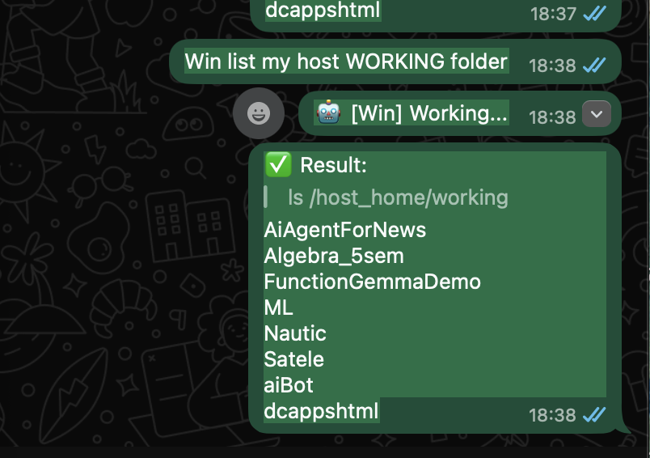

# 🪐 Satele: Autonomous Remote Bridge

Satele is an advanced, multimodal bridge that connects your **WhatsApp** to your **Server/Desktop Environment**. It allows you to control your machine via text or voice commands using AI (Gemini or Ollama).

---

## 🌍 Supported Platforms

| OS | Support Level | Notes |
| :--- | :--- | :--- |
| **macOS** (Silicon/Intel) | ✅ Full | Native support for all features including audio. |
| **Linux** (Ubuntu/Debian) | ✅ Full | Native support. Requires `nodejs`, `python3-venv`, `ffmpeg`. |
| **Windows** | ✅ Full (Docker) | Runs via Docker Desktop. Zero dependency hell. |

---

## 🐳 Docker Deployment (Better for Windows)

Using Docker is the recommended way to run Satele on Windows or for clean, isolated deployments.

### 1. Prerequisite
*   Install [Docker Desktop](https://www.docker.com/products/docker-desktop/).
*   **For Local AI**: Install [Ollama for Windows](https://ollama.com/) (optional, but recommended for speed).

### 2. Quick Start
```bash
# 1. Clone Repo
git clone https://github.com/dcaric/Satele.git ~/satele
cd ~/satele

# 2. Fix Config (Important for Windows)
# Docker mounts satele_cfg.env as a file. If it doesn't exist, Docker creates a directory (error).
touch satele_cfg.env 

# 3. Launch
docker-compose up -d
```

### 3. Configuring Satele in Docker
Since Satele runs inside a container, you use `docker exec` to send configuration commands.

**📱 Link WhatsApp:**
```bash
docker exec -it satele_bridge satele whatsapp
# (Scan the QR code shown in terminal)
```

**🧠 Set AI Keys (Gemini):**
```bash
docker exec satele_bridge satele geminikey YOUR_API_KEY_HERE
```

**🦙 Configure Ollama (Local AI):**
Satele Docker is pre-configured to talk to your host's Ollama at `host.docker.internal:11434`.
1. Ensure Ollama is running on Windows.
2. In Docker, switch to Ollama mode:
   ```bash
   docker exec satele_bridge satele ollama start
   ```

**🤖 Set Bot Name:**
```bash
docker exec satele_bridge satele name M3
```

**📊 Check Status:**
docker exec satele_bridge satele status
```

> *Satele Docker running on Windows:*
> 

---

## 🚀 Installation & Setup

### 1. Clone & Prepare
Clone the repository to your desired location (e.g., `~/satele`):
```bash
git clone https://github.com/dcaric/Satele.git ~/satele
cd ~/satele
```

### 2. Install Dependencies
Run the built-in setup command to install Node.js modules and Python virtual environment:
```bash
./satele setup
```

### 3. Make Command Global
To use `satele` from anywhere (instead of `./satele`), add it to your shell profile.

**On macOS (Zsh):**
```bash
echo 'export PATH="$HOME/satele:$PATH"' >> ~/.zshrc && source ~/.zshrc
```

**On Linux (Bash):**
```bash
echo 'export PATH="$HOME/satele:$PATH"' >> ~/.bashrc && source ~/.bashrc
```

Now you can just type `satele status` from any folder!

---

## 🧠 AI Configuration

Satele supports two AI backends: **Cloud (Google Gemini)** and **Local (Ollama)**.

### Option A: Cloud (Google Gemini)
Best for speed, multimodal (audio/images), and complex reasoning.
1.  **Get Key**: Obtain a key from [Google AI Studio](https://aistudio.google.com/).
2.  **Set Key**:
    ```bash
    satele geminikey AIzaSy...
    ```
3.  **Select Model** (Optional, default is `gemini-2.0-flash`):
    ```bash
    satele gemini gemini-3-flash-preview
    ```
4.  **Track Costs**: Set pricing (e.g., $0.50/1M input, $3.00/1M output):
    ```bash
    satele tokens 0.50 3.00
    ```

### Option B: Local (Ollama)
Best for privacy and offline usage. Free.
1.  **Install/Check**:
    ```bash
    satele ollama
    ```
2.  **Download Model**:
    ```bash
    satele ollama gemma3:4b
    ```
    *(This downloads the model and creates a custom `satele` variant with system prompts)*.
3.  **Switch to Local**:
    ```bash
    satele ollama start
    satele stop && satele start
    ```
4.  **Switch Back to Cloud**:
    ```bash
    satele ollama stop
    satele stop && satele start
    ```

---

## 🛠️ Usage & Commands

### 📱 1. Connect WhatsApp
Link your device to enable remote control:
```bash
satele whatsapp
```
Scan the QR code with WhatsApp (Linked Devices).

### 🤖 2. Manage Service
| Command | Description |
| :--- | :--- |
| `satele start` | Starts all background services. |
| `satele stop` | Stops all services. |
| `satele status` | Shows health, active AI model, and token usage cost. |
| `satele name <name>` | Sets a custom wake-word (e.g. `satele name M1`). Useful for multi-bot setups. |
| `satele setup-sudo` | Configures passwordless `sudo` for Satele (Advanced). |

### 📖 Complete CLI Help
View all available commands by running `satele help`:

```text
🪐 Satele CLI - The Remote Bridge Controller

Usage: satele <command> [arguments]

Commands:
  setup               Install dependencies (Node.js & Python)
  start               Start the bridge services in the background
  stop                Stop all running bridge services
  status              Check if services are running
  kill                Force kill all related processes
  name <name>         Set the bot's trigger name (default: satele)
  tokens <in> <out>   Set pricing for Gemini (e.g. 0.50 3.00)
  gemini <model>      Switch Gemini model (e.g. gemini-3-flash-preview)
  add-number <num>    Whitelist a number (e.g. 38591...)
  remove-number <n>   Remove number from whitelist
  users               Show allowed numbers
  memory              Show long-term memory status
  ollama [model]      Manage local AI (e.g. 'satele ollama gemma3:4b')
  ollama start        Switch to Local Ollama mode
  ollama stop         Switch back to Cloud Gemini mode
  whatsapp            Launch interactive mode to link a device via QR code
  setup-sudo          Enable passwordless sudo (Optional, use with caution)
  install             Install the connection skill globally (for IDE)
  link                Enable remote control in the current project
  help                Show this message

Logs: tail -f /tmp/satele_dcaric.log
```

### 🎙️ 3. Remote Capabilities (WhatsApp)

#### **System Checks**
> *"M1 check disk usage"*
> *"Status report"*
> *"Who is logged in?"*

#### **File Transfer**
> *"Send me satele.log"*
> *"Get config.json"*

> *Sending a file to Satele:*
> 

> *Satele sending a file back:*
> 

#### **Voice Interaction**
> *(Send a Voice Note)*: "Check if the docker container is running and restart it if not."

#### **Direct Shell**
> *"sh: ls -la /var/log"*

---

## 🛡️ Security

### 🔒 User Whitelist
By default, **ONLY your linked WhatsApp account** can control Satele. Messages from other numbers are ignored.
To allow other numbers (e.g., your secondary phone):

| Command | Description |
| :--- | :--- |
| `satele add-number <num>` | Allow a number (e.g. `38591...`). |
| `satele remove-number <num>` | Remove a number from the allowed list. |
| `satele users` | List all allowed numbers. |

### 🔐 Architecture
- **Sudo Access**: Satele runs as your user. It cannot run `sudo` unless you explicitly enable it via `satele setup-sudo`.
- **Environment**: API Keys are stored in `satele_cfg.env` (git-ignored).
- **Logs**: Activity is logged to `satele.log` (git-ignored).
- **WhatsApp**: Uses end-to-end encryption via Multi-Device API.

---

## 🐧 Linux Specifics
- Ensure `ffmpeg` is installed for voice note processing (`sudo apt install ffmpeg`).
- If `satele setup` fails on `npm`, ensure `nodejs` (v18+) is installed.

---

## 🌟 Main Purpose & Vision

Satele is designed to be your **Personal Digital Bridge**. Its core mission is to eliminate the physical boundaries between you and your computer:

*   **Remote File Access**: Imagine you are away from home and realize you need a specific document or log from your main computer. Instead of rushing back, you just ask Satele via WhatsApp, and the file is delivered to you instantly.
*   **Remote Operations**: Need to start a long-running process, run a maintenance script, or check if a service is healthy while you're commuting? Satele executes these actions for you as if you were sitting right at your desk.
*   **System Mastery**: From checking hardware health to managing your local network, Satele provides a voice-and-text interface for your entire home environment.

### 🔭 The Future: A Gateway for Agents
Satele is not just a tool; it's an **extensible platform**. While it currently acts as a bridge for commands and file transfers, it is architected to be a gateway for **multi-agent systems**. 

In the future, Satele can be expanded to leverage specialized AI agents—one might handle coding tasks, another could manage your calendar, and another could monitor your security cameras—all coordinated through a single, seamless WhatsApp conversation.
